# Vite Plugin Plan (Runtime Theme Routing)

## Goals

- Add a new `@svartz/vite` package that:
  - primarily consumes a **CLI-resolved single-vault build config** from `@svartz/config` via the Vite JS API
  - consumes vault-specific `mode` / env passed into Vite by CLI orchestration
  - merges/runs plugins from core + theme + defaults + vault
  - resolves theme layouts/routes from config theme
  - compiles note content into per-note `.svelte` artifacts and exposes runtime manifests/components for SvelteKit consumption
- Keep `apps/web` route files static (no generated routes in `src/routes`), so parallel multi-vault builds remain safe.
- Clarify config naming and ownership:
  - `SvartzConfig` = unresolved, user-authored repo-root config
  - `ResolvedConfig` = flat, guaranteed-resolved, **single-vault** build config passed from CLI to `@svartz/vite`

## Execution Contract

- Treat implementation as incomplete until every frontmatter todo is completed or explicitly marked `[blocked]`.
- If a step is blocked, record the exact missing dependency, failing contract, or external constraint instead of silently narrowing scope.
- If the first Vite/theme/module-graph approach fails, try at least one alternate implementation strategy before declaring the task blocked.
- Before finalizing, run a verification loop covering:
  - locked contract compliance for `ResolvedConfig`, runner state, and virtual modules
  - relevant tests and type/lint/build checks for changed files/packages
  - runtime route/layout smoke behavior in `apps/web`
  - static-route override behavior over `[...slug]/+page.svelte`

## Architecture Decision (locked)

- Use **runtime route/layout resolution** with core static route shells in `apps/web`.
- Do not generate or overwrite `apps/web/src/routes` per vault.
- Keep `@svartz/vite` as the canonical build integration boundary; SvelteKit runtime hooks are not used for artifact discovery/materialization.
- Theme route/layout contract is consumed at runtime through generated artifacts/virtual modules.
- Use a **hybrid artifact model**:
  - keep `files` and `artifacts` in memory as the runner source of truth
  - materialize final vault-scoped generated outputs to disk at the end of `emitArtifacts` so Vite/Svelte can consume concrete `.svelte` modules during dev/build
- Lock the generated paths:
  - generated source root: `.svartz/vaults/<vaultId>/artifacts`
  - finalized build output root: `.svartz/vaults/<vaultId>/dist`
- Use generated module categories, not generated SvelteKit route files:
  - renderable page modules live under `.svartz/vaults/<vaultId>/artifacts/pages/**/*.svelte`
  - shared eager runtime data lives in `.svartz/vaults/<vaultId>/artifacts/index.ts`
- Prefer `pages/` over `routes/` for generated `.svelte` modules so these files are not confused with the real SvelteKit route tree in `apps/web/src/routes`.
- For MVP, note compilation is owned by a first-party emitter inside the existing `emitArtifacts` hook rather than by a new canonical stage.
- Emitter plugins that need to contribute artifacts before final materialization should hook `emitArtifacts` with `enforce: "pre"` or emit earlier from the stage that owns their source data.

```mermaid
flowchart LR
  cliBuild["CLI build/dev orchestration"] --> viteJsApi["Vite JS API (build/createServer)"]
  viteJsApi --> vaultBuildConfig["ResolvedConfig (single vault)"]
  vaultBuildConfig --> themeResolve["resolve theme module"]
  vaultBuildConfig --> pluginMerge["merge plugins layers"]
  themeResolve --> pluginMerge
  pluginMerge --> runnerExec["plugin runner (files working set + artifacts bag)"]
  runnerExec --> emitStage["emitArtifacts stage (compile + materialize)"]
  emitStage --> generatedRoot[".svartz/vaults/<vaultId>/artifacts"]
  generatedRoot --> virtualBridge["virtual:svartz/artifacts"]
  virtualBridge --> artifactsOut["vault-scoped emitted artifacts + virtual modules"]
  artifactsOut --> webShell["apps/web static route shells"]
  webShell --> themeRuntime["theme route/layout render at runtime"]
```




## Locked Contracts

### `ResolvedConfig`

- `ResolvedConfig` is the canonical single-vault build config passed from CLI to `@svartz/vite`.
- It is a flat merge of the current resolved vault shape plus only the top-level metadata still needed at build time.
- Minimum required shape for MVP:

```ts
interface ResolvedConfig {
  readonly version: string;
  readonly $schema?: string;

  readonly id: string;
  readonly path: string;
  readonly outDir: string;
  readonly include: readonly string[];
  readonly exclude: readonly string[];
  readonly linkResolution: LinkResolutionStrategy;
  readonly theme: ResolvedThemeConfig;
  readonly frontmatter: ResolvedFrontmatterConfig;
  readonly target: TargetConfig;
  readonly plugins: readonly unknown[];
}
```

- All paths in `ResolvedConfig` should already be absolute/normalized so `@svartz/vite` and downstream plugins do not perform relative lookups.
- `outDir` is the final Vite/SvelteKit bundle destination consumed by `@svartz/vite`.
- For MVP, config resolution should default `outDir` to `.svartz/vaults/<vaultId>/dist` when the user does not set one explicitly.
- If config resolution internals still need `configDir`, keep it private to `@svartz/config` rather than part of the public `ResolvedConfig` contract.

### Runner state: `files` + `artifacts`

- `files` remains the mutable working set for discovered/preprocessed source files.
- `artifacts` is the expandable emitted output bag.
- Core should introduce:

```ts
interface Artifact {
  readonly key: string;
  readonly path: string;
  readonly type: string;
  readonly pluginId: string;
  readonly contents: string | Uint8Array;
  readonly noteSlug?: string;
  readonly mimeType?: string;
  readonly meta?: Record<string, unknown>;
}

type ArtifactBag = Map<string, Artifact>;
```

- `ArtifactBag` should be keyed by stable output path/key for deterministic replacement.
- `PluginContext` should carry both `files` and `artifacts`.

### `virtual:svartz/theme`

- Public module aligned with the core theme contract.
- Minimum public exports for MVP:

```ts
declare module "virtual:svartz/theme" {
  import type { SvartzTheme, ThemeRouteDefinition } from "@svartz/core";

  export const theme: SvartzTheme;
  export const routes: readonly ThemeRouteDefinition[];
  export function resolveRuntimeRoute(input: {
    pathname: string;
    slug?: string;
  }):
    | {
        route: ThemeRouteDefinition;
        layoutSlot?: string;
        artifactKey?: string;
      }
    | undefined;
  export function resolveRouteToArtifactKey(input: {
    pathname: string;
    slug?: string;
  }): string | undefined;
}
```

- `resolveRuntimeRoute` is the canonical helper the app shell uses to choose the matched route, layout slot, and artifact key without reimplementing route matching in `apps/web`.
- `resolveRouteToArtifactKey` is theme-owned because route patterns are theme-owned.
- `theme.layouts` is a `ThemeLayoutMap` keyed by layout slot names (e.g., `notePage`, `defaultPage`, `tagPage`).
- `theme.routes` defines which layout slot applies to which route via `ThemeRouteDefinition.layoutSlot`.
- Layouts are **not generated by `@svartz/vite`**; they are theme-owned and resolved directly from the theme package.
- `virtual:svartz/theme` should re-import/re-export from the resolved theme module path after validation; it must not serialize `ThemeComponentLoader` functions or component references into JSON-like payloads.

### `virtual:svartz/artifacts`

- Public module for pipeline outputs.
- This is a runtime-facing projection of the internal `ArtifactBag`, not the raw bag itself.
- It is also the bridge into Vite's module graph: it references generated modules under `.svartz/vaults/<vaultId>/artifacts` so SvelteKit can bundle them without `apps/web` knowing their real paths.
- Minimum public exports for MVP:

```ts
declare module "virtual:svartz/artifacts" {
  import type { Graph, Index } from "@svartz/core";

  export interface RuntimeArtifactRecord {
    readonly key: string;
    readonly path: string;
    readonly type: string;
    readonly noteSlug?: string;
  }

  export const artifacts: ReadonlyMap<string, RuntimeArtifactRecord>;
  export function loadNoteArtifact(
    key: string,
  ): Promise<{ default: unknown }>;
  export const index: Index;
  export const graph: Graph;
  export const backlinks: Index["backlinks"];
  export const search: Index["entries"];
}
```

- `artifacts` is the runtime artifact manifest; `index`, `graph`, `backlinks`, and `search` are convenience exports for first-party consumers.
- `index`, `graph`, `backlinks`, and `search` stay eagerly available because theme layouts/components may depend on them globally.
- Note artifact lookup is intentionally split:
  - `virtual:svartz/theme` resolves route/pattern to artifact key
  - `virtual:svartz/artifacts` provides the artifact manifest plus the note loader helper

## Implementation Scope

### 1) Fix config/core types for single-vault build input + artifacts

- Add/adjust shared types in `[packages/config/src/types](packages/config/src/types)` and `[packages/core/src/types.ts](packages/core/src/types.ts)` so the vite plugin and runner can consume a **single-vault resolved build config**, not a multi-vault `ResolvedSvartzConfig` bundle.
- Rename/fix the resolved config model so:
  - `SvartzConfig` remains the unresolved user-authored config file model
  - `ResolvedConfig` becomes the canonical **single-vault**, flat, guaranteed-resolved build config consumed by `@svartz/vite` and the runner
- `ResolvedConfig` should collapse the active resolved vault into the top-level object, plus only the build metadata still needed publicly (`version` and optional `$schema`).
- `ResolvedConfig.outDir` should be treated as the final bundle output path; config resolution supplies the default `.svartz/vaults/<vaultId>/dist` when the user does not configure one.
- Remove or refactor any misleading multi-vault “resolved config” typing so the runtime/build path does not imply that `@svartz/vite` receives all vaults.
- Introduce artifact types in core:
  - `Artifact`
  - `ArtifactBag` (prefer `Map<string, Artifact>` keyed by output path for deterministic replacement)
- Keep `files: ProcessedFile[]` as the mutable working set for transformers; do **not** treat discovered source files as final artifacts.

### 2) Create `@svartz/vite` package scaffold

- Add package at `[packages/vite](packages/vite)` with:
  - `src/index.ts` plugin factory
  - `src/options.ts` plugin options centered on pre-resolved `ResolvedConfig`
  - `src/context.ts` normalized internal runtime context (`config`, `mode`, env snapshot`) for CLI ↔` @svartz/vite` coordination only
  - `src/theme-resolver.ts` resolve the theme module from `ResolvedConfig.theme.base`
  - `src/artifacts.ts` artifact writing/paths
  - `src/virtual-modules.ts` runtime module registration
  - exported virtual module declaration types (for TS / language server)
- Prefer plugin options shaped around:
  - `config` as pre-resolved `ResolvedConfig`
- Add `package.json`, `tsconfig.json`, `README.md`, tests.

### 3) Add/complete plugin runner APIs in core plugin module

- Extend `[packages/core/src/plugin](packages/core/src/plugin)` with runner-focused utilities:
  - stage execution helper with `enforce` sorting + `parallel` semantics
  - lifecycle hook execution (`buildStart`, `configResolved`, `buildEnd`, `handleChange`)
  - centralized fatal/non-fatal collection behavior
- Extend plugin context/result model so the runner carries:
  - `files` working set for mutable source/preprocessed content
  - `artifacts` bag for emitted outputs
  - existing metadata helpers (`meta`) as needed
- Keep author-facing plugin contract unchanged.
- Export runner API via `[packages/core/src/index.ts](packages/core/src/index.ts)`.

### 4) Implement 4-layer plugin merge for runner

- Ensure effective merge order is:
  1. core plugins (`@svartz/plugins`)
  2. theme `pluginPreset.plugins`
  3. `config.defaults.plugins`
  4. `vault.plugins`
- Keep existing replacement semantics (same id replaces in-place; new id appends; disabled removed).
- Add/adjust merge helper in core or local `@svartz/vite` adapter if core merge is currently 2-layer.

### 5) Define runtime route matcher semantics in core (consumed by `@svartz/vite`)

- Add/export a route matcher helper in core that consumes `ThemeRouteDefinition[]` and resolves a pathname according to SvelteKit-inspired specificity rules:
  - prefer more specific static routes over dynamic ones
  - support only `slug`-named params for MVP
  - support rest-style slug routes (e.g. `[...slug]`) for note/folder-style matching
  - allow later expansion for groups/advanced layout semantics, but keep those out of MVP
  - use explicit `priority` if present as an override/tiebreaker, otherwise use SvelteKit-like specificity ordering inspired by [SvelteKit advanced routing](https://svelte.dev/docs/kit/advanced-routing) and its [sorting rules](https://svelte.dev/docs/kit/advanced-routing#Sorting)
- Lock MVP routing semantics:
  - root `/` resolves to vault-root `index.md` or `README.md`
  - note pages resolve normal note content by slug
  - folder pages render a folder listing and may optionally render `index.md` / `README.md` above the listing
  - tag pages render a tag listing and may optionally render a note under the theme-defined tag namespace above the listing
  - not-found renders static 404 UI with optional note-backed customization under theme-defined errors route (e.g. `/errors/404.md`)

### 6) Build theme resolution pipeline in `@svartz/vite`

- From `ResolvedConfig.theme.base`, resolve the theme package/module.
- Load theme export and validate via `defineTheme`/`validateTheme` path.
- Normalize component loaders (`sync` or `lazy`) for runtime usage.
- Surface resolved theme-owned runtime data through `virtual:svartz/theme`.
- `virtual:svartz/theme` should align with `SvartzTheme` typing from core, plus any narrowly-scoped helpers required by the app shell (for example route matching / route resolution helpers).
- Implement `virtual:svartz/theme` by re-exporting from the validated resolved theme module path plus plugin-owned helpers, rather than attempting to serialize the full validated theme object.

### 7) Add note compilation + artifact emission model

- Add a first-party note compiler/emitter inside the existing `emitArtifacts` stage that converts each final markdown note into a `.svelte` component artifact (mdsvex-like output).
- Prefer **one emitted `.svelte` artifact per note** over a single giant exported module:
  - better fit for Svelte/Vite compilation
  - better sourcemaps and HMR behavior
  - easier per-note invalidation
  - parallel-build safe when written to a vault-scoped generated directory
- Keep transformers scoped to the `files` working set (markdown/source content).
- Keep emitters responsible for creating/removing artifacts in the artifact bag.
- Keep `emitArtifacts` as the final write/materialization step that writes the artifact bag to `.svartz/vaults/<vaultId>/artifacts`, not to `apps/web/src/routes`.
- Lock generated artifact layout:
  - route-renderable `.svelte` modules go in `.svartz/vaults/<vaultId>/artifacts/pages/**/*.svelte`
  - this includes note pages plus generated error/tag/folder page modules when needed by the runtime theme shell
  - shared eager runtime data goes in `.svartz/vaults/<vaultId>/artifacts/index.ts`
- Ensure required MVP artifacts include:
  - one `.svelte` note artifact per renderable note/page
  - canonical eager `index.ts` artifact using existing core `Index`
  - eager projections/exports for `graph`, `backlinks`, and `search`
- Allow optional custom/static artifacts later (rss, sitemap, etc.) through the expandable artifact bag.

### 8) Vite plugin integration points

- `configResolved`: normalize the provided `ResolvedConfig`, target vault/theme runtime inputs, and merged plugin list; capture active Vite `mode` and resolved env (`loadEnv`) for that vault build.
- `buildStart`: run pipeline stages through runner and prepare artifacts.
- `handleHotUpdate` (or equivalent): map file changes to `handleChange` and affected stages.
- `resolveId/load`: expose the minimal public virtual module surface for app runtime:
  - `virtual:svartz/theme`
  - `virtual:svartz/artifacts`
- `virtual:svartz/theme` should provide the canonical runtime route-resolution helper used by `apps/web` layout/page shells.
- `virtual:svartz/artifacts` should reference generated modules under `.svartz/vaults/<vaultId>/artifacts` so Vite can compile/bundle them as part of the normal app graph.
- keep runtime context (`vaultId`, `mode`, env) internal to the vite plugin unless implementation proves a narrow public adapter is necessary.
- ship matching ambient type declarations for the public virtual module ids from `@svartz/vite`, and ensure consuming app tsconfig can see them.
- Use the **Vite JS API** from CLI orchestration rather than shelling out to `vite build`, so the CLI can pass `ResolvedConfig` objects and mode directly, consistent with [Vite’s JavaScript API](https://vite.dev/guide/api-javascript) and mode handling from [CLI/env docs](https://vite.dev/guide/cli) / [env-and-mode](https://vite.dev/guide/env-and-mode).
- Keep the exact Turbo/pkgjson-script choreography flexible for implementation:
  - CLI owns config resolution and vault selection
  - app/web build tasks may remain thin wrappers around CLI subcommands if needed
  - the important contract is that `@svartz/vite` receives `ResolvedConfig`, not that it discovers vaults itself

### 9) Runtime route shell integration in `apps/web`

- Keep static route files in `[apps/web/src/routes](apps/web/src/routes)`.
- MVP app scope is client-side `+layout.svelte` / `+page.svelte` route shells only.
- Lock layout ownership:
  - `**apps/web/src/routes/+layout.svelte`** is a thin SvelteKit layout stub that imports theme layouts from `virtual:svartz/theme`.
  - It reads the resolved route's `layoutSlot` and renders the corresponding theme layout, nested around page content via SvelteKit's layout system.
  - Layouts are **theme-owned**, never generated or inlined into page artifacts.
  - Multiple layouts per theme are supported: theme defines `ThemeLayoutMap` (layout slots) and routes specify `layoutSlot` to select which layout applies to each route.
- Add/adjust a small runtime shell route structure (root + catch-all) that:
  - imports only the resolved theme/artifact runtime surface it needs
  - resolves the active route definition through `virtual:svartz/theme`'s canonical route-resolution helper
  - resolves the note artifact key through `virtual:svartz/theme` and loads the note component through `virtual:svartz/artifacts`
  - renders theme-selected layout/page components as thin adapters
- Do **not** assume a single `Layout` / `Page` export is sufficient for all routes; route/page data will need to be passed into theme components by the shell.
- Keep future server-side hooks/middleware/theme-defined server behavior explicitly out of MVP.
- Do not write generated route files into `apps/web/src/routes`.

### 10) Multi-vault-safe outputs

- Ensure artifacts and virtual module payloads are scoped by vault id/output dir.
- Lock per-vault paths:
  - generated artifact root: `.svartz/vaults/<vaultId>/artifacts`
  - finalized bundle output default: `.svartz/vaults/<vaultId>/dist`
- Avoid global mutable paths that collide across parallel builds.
- Document required plugin options (`config`, `mode`, env policy, output scopes) and defaults.

### 11) Tests and verification

- Add focused tests in `packages/vite/tests` for:
  - handoff/integration with pre-resolved `ResolvedConfig`
  - `outDir` defaulting/consumption behavior through config resolution + vite handoff
  - mode/env propagation correctness from Vite into plugin context
  - theme resolution success/failure
  - 4-layer plugin merge order
  - stage runner ordering (`pre/default/post`) and parallel flags
  - `virtual:svartz/theme` payload shape
  - `resolveRuntimeRoute` behavior, including layout-slot selection
  - `resolveRouteToArtifactKey` behavior
  - `virtual:svartz/artifacts` payload shape
  - `loadNoteArtifact` behavior
  - generated artifact layout under `.svartz/vaults/<vaultId>/artifacts`
  - eager `index`/`graph`/`backlinks`/`search` exports from `virtual:svartz/artifacts`
  - route matcher behavior and specificity ordering
  - root/index/README resolution
  - folder page overlay + listing behavior
  - tag page overlay + listing behavior
  - note compilation to `.svelte` artifacts
  - exported virtual module type declarations resolve cleanly in TypeScript/editor contexts
- Add app-level smoke test path in `apps/web` proving runtime theme route/layout resolution.
- Add an app-level test proving an explicit static route in `apps/web/src/routes` overrides the `[...slug]/+page.svelte` runtime shell.

### 12) Docs and alignment

- Add package docs for `@svartz/vite` usage and options.
- Update docs in `vaults/docs` for runtime routing model and the minimal public virtual module surface.
- Update relevant contract docs if runner behavior is codified in core exports.
- Document how consumers get virtual module typings (`types` export / tsconfig inclusion).
- Track long-term server-side theme features (middleware, server hooks, auth-backed notes/pages) as explicitly out-of-scope for MVP and create a follow-up item/issue during close-out.
- Track deferred SEO/site metadata config fields (`title`, `description`, and related shared SEO metadata) in `TODO.md` and GitHub as explicitly out-of-scope for this `@svartz/vite` MVP.

## Key Files Expected

- Update: `[packages/core/src/types.ts](packages/core/src/types.ts)` shared build/artifact types
- Update: `[packages/config/src/types](packages/config/src/types)` to define/fix `ResolvedConfig` as single-vault build typing
- Update: `[packages/config/src/index.ts](packages/config/src/index.ts)` exports for `ResolvedConfig` and loader/resolver flow
- New: `[packages/vite/src/index.ts](packages/vite/src/index.ts)`
- New: `[packages/vite/src/context.ts](packages/vite/src/context.ts)`
- New: `[packages/vite/src/theme-resolver.ts](packages/vite/src/theme-resolver.ts)`
- New: `[packages/vite/src/virtual-modules.ts](packages/vite/src/virtual-modules.ts)`
- New: `[packages/vite/src/artifacts.ts](packages/vite/src/artifacts.ts)`
- Update: `[packages/core/src/plugin](packages/core/src/plugin)` runner-related modules
- Update: `[packages/core/src/index.ts](packages/core/src/index.ts)` exports
- Update: `[apps/web/src/routes](apps/web/src/routes)` runtime shell routes/layout wiring
- Update: `[TODO.md](TODO.md)` deferred server-side theme feature follow-up

## Risks / Guardrails

- Route precedence conflicts with existing SvelteKit routes: keep runtime shell narrow and explicit.
- Theme route matcher must stay intentionally narrower than full SvelteKit routing for MVP; groups/advanced layout inheritance are follow-up work, not accidental partial support.
- Keep note-body rendering path explicit: route resolution without a compiled note artifact is incomplete.
- Theme loader async behavior: normalize and cache resolved components per build session.
- Parallel build collisions: enforce vault-scoped artifacts and module payload keys.
- Prefer vault-scoped generated note `.svelte` artifacts over writing into `apps/web`, to preserve parallel safety and better HMR/compiler ergonomics.
- Keep generated renderable modules under `artifacts/pages/`**, not `artifacts/routes/`**, so they are clearly runtime content modules rather than an alternate SvelteKit route tree.
- Keep layouts theme-owned: `@svartz/vite` does not generate layout artifacts; layouts are resolved from the theme package through `virtual:svartz/theme` and composed via SvelteKit's layout nesting system.
- Do not let `@svartz/vite` become responsible for monorepo/root vault discovery; that ownership stays with CLI + config resolution.
- Keep config/theme/plugin contract boundaries strict (no circular package deps).
- Prefer completing the migration over preserving legacy shapes: if an old type, export, or runner assumption conflicts with the locked plan, rewrite it fully instead of layering compatibility shims unless the plan explicitly requires compatibility.

