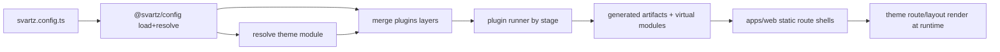

# Vite Plugin Plan (Runtime Theme Routing)

## Goals

- Add a new `@svartz/vite-plugin` package that:
  - loads/resolves Svartz config via `@svartz/config`
  - merges/runs plugins from core + theme + defaults + vault
  - resolves theme layouts/routes from config theme
  - provides runtime manifests/components for SvelteKit consumption
- Keep `apps/web` route files static (no generated routes in `src/routes`), so parallel multi-vault builds remain safe.

## Architecture Decision (locked)

- Use **runtime route/layout resolution** with core static route shells in `apps/web`.
- Do not generate or overwrite `apps/web/src/routes` per vault.
- Theme route/layout contract is consumed at runtime through generated artifacts/virtual modules.

## Implementation Scope

### 1) Create `@svartz/vite-plugin` package scaffold

- Add package at `[packages/vite-plugin](packages/vite-plugin)` with:
  - `src/index.ts` plugin factory
  - `src/options.ts` plugin options and defaults
  - `src/theme-resolver.ts` resolve `theme.base` from vault config
  - `src/artifacts.ts` artifact writing/paths
  - `src/virtual-modules.ts` runtime module registration
- Add `package.json`, `tsconfig.json`, `README.md`, tests.

### 2) Add/complete plugin runner APIs in core plugin module

- Extend `[packages/core/src/plugin](packages/core/src/plugin)` with runner-focused utilities:
  - stage execution helper with `enforce` sorting + `parallel` semantics
  - lifecycle hook execution (`buildStart`, `configResolved`, `buildEnd`, `handleChange`)
  - centralized fatal/non-fatal collection behavior
- Keep author-facing plugin contract unchanged.
- Export runner API via `[packages/core/src/index.ts](packages/core/src/index.ts)`.

### 3) Implement 4-layer plugin merge for runner

- Ensure effective merge order is:
  1. core plugins (`@svartz/plugins`)
  2. theme `pluginPreset.plugins`
  3. `config.defaults.plugins`
  4. `vault.plugins`
- Keep existing replacement semantics (same id replaces in-place; new id appends; disabled removed).
- Add/adjust merge helper in core or local vite-plugin adapter if core merge is currently 2-layer.

### 4) Build theme resolution pipeline in vite-plugin

- From resolved vault config, resolve theme package/module (`string` or `{ base }`).
- Load theme export and validate via `defineTheme`/`validateTheme` path.
- Normalize component loaders (`sync` or `lazy`) for runtime usage.
- Surface resolved theme metadata (layouts/routes/capabilities/artifacts) to runtime modules.

### 5) Vite plugin integration points

- `configResolved`: load svartz config + target vault + theme + merged plugin list.
- `buildStart`: run pipeline stages through runner and prepare artifacts.
- `handleHotUpdate` (or equivalent): map file changes to `handleChange` and affected stages.
- `resolveId/load`: expose virtual modules for app runtime, e.g.:
  - `virtual:svartz/theme`
  - `virtual:svartz/routes`
  - `virtual:svartz/artifacts`

### 6) Runtime route shell integration in `apps/web`

- Keep static route files in `[apps/web/src/routes](apps/web/src/routes)`.
- Add a small runtime shell route structure (catch-all + root handling) that:
  - imports virtual modules
  - resolves active route definition by slug/path
  - selects theme layout/component loaders at runtime
- Do not write generated route files into `apps/web/src/routes`.

### 7) Multi-vault-safe outputs

- Ensure artifacts and virtual module payloads are scoped by vault id/output dir.
- Avoid global mutable paths that collide across parallel builds.
- Document required plugin options (`vaultId`, `configPath`, output scopes) and defaults.

### 8) Tests and verification

- Add focused tests in `packages/vite-plugin/tests` for:
  - config load/resolve integration
  - theme resolution success/failure
  - 4-layer plugin merge order
  - stage runner ordering (`pre/default/post`) and parallel flags
  - virtual module payload shape
- Add app-level smoke test path in `apps/web` proving runtime theme route/layout resolution.

### 9) Docs and alignment

- Add package docs for `@svartz/vite-plugin` usage and options.
- Update docs in `vaults/docs` for runtime routing model and virtual modules.
- Update relevant contract docs if runner behavior is codified in core exports.

## Key Files Expected

- New: `[packages/vite-plugin/src/index.ts](packages/vite-plugin/src/index.ts)`
- New: `[packages/vite-plugin/src/theme-resolver.ts](packages/vite-plugin/src/theme-resolver.ts)`
- New: `[packages/vite-plugin/src/virtual-modules.ts](packages/vite-plugin/src/virtual-modules.ts)`
- Update: `[packages/core/src/plugin](packages/core/src/plugin)` runner-related modules
- Update: `[packages/core/src/index.ts](packages/core/src/index.ts)` exports
- Update: `[apps/web/src/routes](apps/web/src/routes)` runtime shell routes/layout wiring

## Risks / Guardrails

- Route precedence conflicts with existing SvelteKit routes: keep runtime shell narrow and explicit.
- Theme loader async behavior: normalize and cache resolved components per build session.
- Parallel build collisions: enforce vault-scoped artifacts and module payload keys.
- Keep config/theme/plugin contract boundaries strict (no circular package deps).

