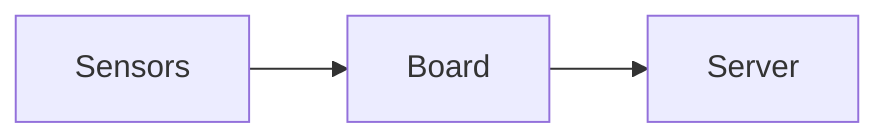

# The backyard weather station

Four sensors, one solar panel, and a dry box on a pole.

Press **P** to present this note. Arrow keys move between slides; Esc ends.

---

## What it measures

- Temperature and humidity (SHT45)
- Pressure (BMP390)
- Wind speed from a cup anemometer
- Rain, once the gauge arrives

---

## How it reports

The board wakes every five minutes and posts one reading:



```ts
await post("/readings", { temperature, humidity, pressure });
```

---

## What went wrong

> [!warning] The first enclosure leaked
> Rain got past the cable gland in week two. A drip loop and a second gland fixed it.

![[station.svg]]

---

## Next

Dew point on the dashboard, then a rain gauge.
